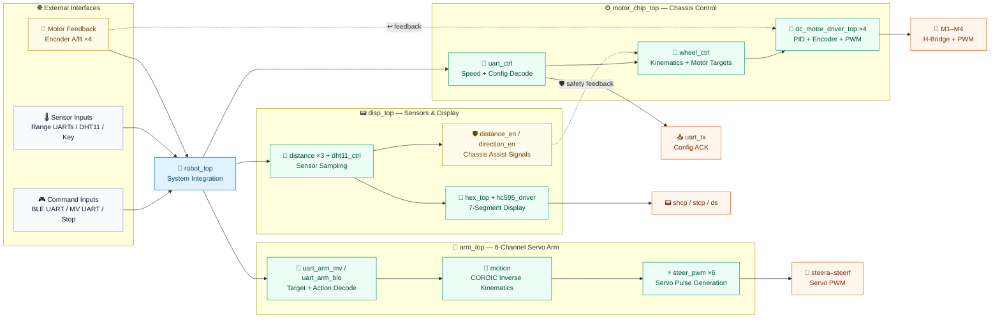

<a id="top"></a>

<div align="center">

<h1>🤖 RoboMotion-FPGA</h1>

<p><strong>FPGA-Based Omnidirectional Mobile Manipulator Control System</strong></p>

<p>
  4-Wheel Omni Chassis · 6-DOF Servo Arm · CORDIC Kinematics<br/>
  Multi-UART Control · Sensor Suite · PID Motor Driver
</p>

    [](verilog/) [](constrain/)

[📖 中文文档](README_CN.md) · [🏗️ Architecture](#-architecture) · [🧱 Modules](#-modules) · [📡 UART Protocol](#-uart-protocol) · [🚀 Quick Start](#-quick-start)

</div>

---

## 📖 Overview

<div align="center">

<table>
<tr>
<td width="70%">

> ⚡ **RoboMotion-FPGA** is a complete Verilog HDL control system for a mobile manipulation robot targeting Xilinx FPGA platforms. It integrates an **omnidirectional four-wheel chassis**, a **six-servo robotic arm subsystem**, **sensor and display peripherals**, and **multiple UART command interfaces** into a single, unified top-level hardware design — purpose-built for autonomous mobile grasping applications. 🎯

</td>
<td width="30%" align="center">

<div align="center">
  <p>🤖 &nbsp; 🏃💨 &nbsp; 📡 &nbsp; 🦾 &nbsp; 🚗 🚗 🚗 🚗 🚗 🚗</p>
</div>

</td>
</tr>
</table>

</div>

---

## ✨ Highlights

<div align="center">
<h3>What makes this project <code>✨ Awesome ✨</code>?</h3>
</div>

<table>
<tr>
<td width="33%" valign="top">

<h3 align="center">
  🚗<br/>
  Mobile Chassis
</h3>

<p>4-channel DC motor drive with encoder feedback, PWM output, and <strong>speed PID closed-loop control</strong>. Smooth and precise motion guaranteed! 🏎️💨</p>

</td>
<td width="33%" valign="top">

<h3 align="center">
  🧮<br/>
  Kinematics Engine
</h3>

<p>Three motion models: <strong>Mecanum</strong> 🔄, <strong>4-wheel omni</strong> ➕, and <strong>3-wheel omni</strong> 🔺 — selectable at runtime via UART. Pick your wheels, pick your moves! 😎</p>

</td>
<td width="33%" valign="top">

<h3 align="center">
  🦾<br/>
  Robotic Arm
</h3>

<p>6-channel servo PWM with <strong>CORDIC-based inverse kinematics</strong> for arm positioning and gripper control. Reach, grab, conquer! 🎯✊</p>

</td>
</tr>
<tr>
<td width="33%" valign="top">

<h3 align="center">
  📡<br/>
  Multi-Protocol UART
</h3>

<p>Bluetooth control 📱, machine-vision input 👁️, configuration ACK TX ✅, and FSM-based command parsing — all over configurable UART channels. Talk to your robot your way! 💬</p>

</td>
<td width="33%" valign="top">

<h3 align="center">
  🌡️<br/>
  Sensor Suite
</h3>

<p>DHT11 temperature &amp; humidity 🌤️, UART-based distance inputs (×3) 📏, push-button inputs 🔘, and 74HC595-driven 7-segment display 🔢. Your robot has senses! 👃</p>

</td>
<td width="33%" valign="top">

<h3 align="center">
  🔧<br/>
  Developer Friendly
</h3>

<p>Modular hierarchy 🧩 and clean top-level integration — easy to understand, easy to extend. Clone it, tweak it, make it yours! 🚀😝</p>

</td>
</tr>
</table>

<br/>

<div align="center">

<p>
  🚗 ────── 🧮 ────── 🦾 ────── 📡 ────── 🌡️ ────── 🔧<br/>
  ✨ ────────────────── 🎉 ────────────────── ✨
</p>

</div>

---

## 🏗️ Architecture

<div align="center">
<h3>📐 System Block Diagram 🔍</h3>
<i>Click to expand & zoom — it all starts with <code>robot_top</code>!</i>
</div>

<br/>



---

## 🧱 Modules

<div align="center">
<h3>📦 What's Inside the Toolbox? 🔧</h3>
</div>

| 🏷️ Subsystem | ⚡ Top Module | 🔑 Key Files |
|:---|:---|:---|
| 🧩 System Integration | [`robot_top.v`](verilog/rtl/top/robot_top.v) | Connects chassis, arm, display, sensors, and UART channels |
| ⚙️ Chassis Control | [`motor_chip_top.v`](verilog/rtl/top/motor_chip_top.v) | [`wheel_ctrl.v`](verilog/rtl/motion/wheel_ctrl.v), [`dc_motor_driver_top.v`](verilog/rtl/top/dc_motor_driver_top.v), [`uart_ctrl.v`](verilog/rtl/comm/uart_ctrl.v) |
| 🔄 Wheel Kinematics | [`wheel_ctrl.v`](verilog/rtl/motion/wheel_ctrl.v) | [`Mcknum_wheel_calculate.v`](verilog/rtl/motion/Mcknum_wheel_calculate.v), [`all_direction_wheel_four_calculate.v`](verilog/rtl/motion/all_direction_wheel_four_calculate.v), [`all_direction_wheel_three_calculate.v`](verilog/rtl/motion/all_direction_wheel_three_calculate.v) |
| 🔌 Motor Driver | [`dc_motor_driver_top.v`](verilog/rtl/top/dc_motor_driver_top.v) | [`controller.v`](verilog/rtl/motor/controller.v), [`controller_PID.v`](verilog/rtl/motor/controller_PID.v), [`encoder.v`](verilog/rtl/motor/encoder.v), [`pwm_generate.v`](verilog/rtl/motor/pwm_generate.v) |
| 🦾 Robotic Arm | [`arm_top.v`](verilog/rtl/top/arm_top.v) | [`motion.v`](verilog/rtl/motion/motion.v), [`steer_pwm.v`](verilog/rtl/motor/steer_pwm.v), [`uart_arm_ble.v`](verilog/rtl/comm/uart_arm_ble.v), [`uart_arm_mv.v`](verilog/rtl/comm/uart_arm_mv.v) |
| 📐 CORDIC Math | [`motion.v`](verilog/rtl/motion/motion.v) | [`cordic_sincos.v`](verilog/rtl/math/cordic_sincos.v), [`cordic_arctan.v`](verilog/rtl/math/cordic_arctan.v), [`cordic_arccos.v`](verilog/rtl/math/cordic_arccos.v), [`cordic_arctanh.v`](verilog/rtl/math/cordic_arctanh.v) |
| 📟 Sensors & Display | [`disp_top.v`](verilog/rtl/top/disp_top.v) | [`dht11_ctrl.v`](verilog/rtl/peripheral/dht11_ctrl.v), [`distance.v`](verilog/rtl/peripheral/distance.v), [`hc595_driver.v`](verilog/rtl/peripheral/hc595_driver.v), [`hex_top.v`](verilog/rtl/top/hex_top.v) |

---

## 📡 UART Protocol

<div align="center">
<h3>💬 How to Talk to Your Robot 🤖</h3>
</div>

> 💡 **Tip:** Successful configuration commands return `Set Successful!` over UART. 🎉
>
> Command parsing is a mix of ASCII keyword commands and fixed binary frames.

| 🎛️ Category | ⌨️ Command | 📝 Description | 📋 Example / Range |
|:---|:---|:---|:---|
| 🔧 System | `baud+<n>` | Set UART baud preset | `baud+0` – `baud+4` |
| 🚗 Motion | `wheel+<n>` | Select wheel kinematics model | `wheel+0` Mecanum 🔄, `wheel+1` 4-wheel omni ➕, `wheel+2` 3-wheel omni 🔺 |
| ⚙️ Config | `gr+<value>` | Set gear ratio | `gr+30` |
| ⚙️ Config | `Ppr+<value>` | Set encoder PPR | `Ppr+13` |
| ⚙️ Config | `alen+<mm>` | Set chassis dimension A 📏 | `alen+200` |
| ⚙️ Config | `blen+<mm>` | Set chassis dimension B 📏 | `blen+150` |
| 🎮 Control | `55 A5 sx x sy y sz z F0` | Chassis speed frame with sign bytes `sx/sy/sz` and magnitudes `x/y/z` 🏎️ | `sx/sy/sz`: `00` positive ✅, `01` negative ❌ |
| 💃 Action | `55 C5 mode F0` | Preset dance control frame 🕺 | `mode=01` start ▶️, `mode=00` clear/reset ⏹️ |
| 🦾 Arm BLE | `DD EE ... FF` | Arm action frame for observe 👀 / move 🎯 / pack 📦 / put 🫳 / catch ✊ | Parsed by [`uart_arm_ble.v`](verilog/rtl/comm/uart_arm_ble.v) |
| 🦾 Arm MV | `AA BB ... CC` | Vision target frame carrying color 🎨, signed X/Y 📍, and theta 🧭 | Parsed by [`uart_arm_mv.v`](verilog/rtl/comm/uart_arm_mv.v) |

---

## 📦 Repository Layout

<div align="center">
<h3>🗂️ File Tree &mdash; Where Everything Lives 🏡</h3>
</div>

```text
📦 RoboMotion-FPGA/
├── 📂 verilog/                       📦 56 Hardware Source Files
│   ├── 📂 rtl/                       🔧 RTL Design Sources
│   │   ├── 📂 top/                   🧩 System Tops (robot_top, arm_top, motor_chip_top, ...)
│   │   ├── 📂 comm/                  📨 UART Communication (uart_*, fsm_baud)
│   │   ├── 📂 motion/                🔄 Kinematics & Motion Control
│   │   ├── 📂 motor/                 🔌 Motor Driver, PID, Encoder, PWM
│   │   ├── 📂 math/                  📐 CORDIC, Multiplier, Divider
│   │   ├── 📂 peripheral/            🌡️ Sensor, Display, Timer, Key Filter
│   │   └── 📂 protocol/              📋 FSM Protocol Parsers (fsm_gr, fsm_ppr, ...)
│   ├── 📂 filelists/                 📋 Legacy filelists (Windows absolute paths)
│   ├── 📂 tb/                        🚧 Testbench directory (currently empty)
│   └── 📂 sim/                       🚧 Simulation directory (currently empty)
├── 📂 constrain/                     📏 Pin Constraints
│   ├── 📄 robot_top_constrain.xdc
│   └── 📄 disp_top_constrain.xdc
└── 📄 README.md / README_CN.md       📖 Documentation
```

<details>
<summary><b>🔍 Expand Full Hardware Topology 🏗️</b></summary>

<br/>

```text
🧩 robot_top
├── 📟 disp_top
│   ├── 🔢 hex_top / hc595_driver
│   ├── 🌡️ dht11_ctrl
│   ├── 📏 distance ×3
│   ├── 📡 uart_ble
│   └── 🔘 switch_key_filter
├── ⚙️ motor_chip_top
│   ├── 🔄 wheel_ctrl
│   │   ├── 🛞 Mcknum_wheel_calculate
│   │   ├── ➕ all_direction_wheel_four_calculate
│   │   ├── 🔺 all_direction_wheel_three_calculate
│   │   └── 🔌 dc_motor_driver_top ×4
│   │       ├── 🧭 encoder / encoder_AB_detect
│   │       ├── 🧠 controller / controller_PID / controller_Speed_loop
│   │       ├── ⚡ pwm_generate
│   │       └── 🔩 dc_motor_driver
│   └── 📡 uart_ctrl
│       ├── 📋 fsm_gr / fsm_ppr / fsm_wheel / fsm_a_len / fsm_b_len / fsm_baud
│       ├── 🎮 uart_cmd / dance_cmd
│       ├── 🧮 multiplier / divider
│       └── 📤 uart_data_tx
└── 🦾 arm_top
    ├── 📐 motion
    │   ├── 🌀 cordic_sincos
    │   ├── 🧭 cordic_arctan
    │   └── 📏 cordic_arccos
    ├── ⚡ steer_pwm ×6
    ├── 👁️ uart_arm_mv
    └── 📶 uart_arm_ble
```

</details>

---

## 🛠️ Development Environment

| 🖥️ Tool | 🎯 Purpose |
|:---|:---|
|  | Synthesis, implementation, timing analysis, and bitstream generation |
|  | Target hardware; see `.xdc` files for package pin assignments |

---

## 🚀 Quick Start

<div align="center">
<h3>⚡ Get Up and Running in 7 Steps! 🏁</h3>
</div>

1. 📁 Create a new project in **Xilinx Vivado**
2. 📥 Add all Verilog sources from [`verilog/rtl/`](verilog/rtl/)
3. 📌 Add XDC constraints from [`constrain/`](constrain/)
4. 🔄 Regenerate or replace the bundled filelists if your toolflow cannot use the legacy Windows absolute paths in [`verilog/filelists/`](verilog/filelists/)
5. 🎯 Set [`robot_top.v`](verilog/rtl/top/robot_top.v) as the **system top module**
6. ⚙️ Run **Synthesis → Implementation → Generate Bitstream**
7. 🔌 Download the bitstream to your FPGA board and power on ⚡

<br/>

<div align="center">

<p>📁 ──→ 📥 ──→ 📌 ──→ 🔄 ──→ 🎯 ──→ ⚙️ ──→ 🔌 ✨ Done! ✨</p>

</div>

---

## 📊 Project Stats

<div align="center">

| 📈 Metric | 🔢 Count | 🏁 Status |
|:---|:---:|:---:|
| 🧩 Verilog Modules | **56** | 🏆 |
| 📏 XDC Constraints | **2** | ✅ |
| 📐 CORDIC Operators | **4** | ✅ |
| 🔄 Kinematic Models | **3** | ✅ |
| 📡 UART Interfaces | **4+** | ✅ |
| 🔌 Motor Channels | **4** | ✅ |
| ⚡ Servo Channels | **6** | ✅ |

<br/>


</div>

---

## 🙏 Acknowledgements

<div align="center">

| 🤝 Special thanks to... | 💝 Appreciation |
|:---|:---:|
| Xilinx / AMD FPGA Ecosystem | 🎯 |
| The Open-Source HDL Community | 🌍 |
| All Contributors & Users | 🫵😝 |

<br/>

<picture>
  <source media="(prefers-color-scheme: dark)" srcset="https://raw.githubusercontent.com/andreasbm/readme/master/assets/lines/rainbow.png">
  
</picture>

</div>

---

## 📜 License

<div align="center">

<table>
<tr>
<td>

This project is intended for **educational and research use**. 📚🔬

</td>
<td>

<p>📖 ──→ 🧠 ──→ 💡 ──→ 🤖</p>

</td>
</tr>
</table>

</div>
