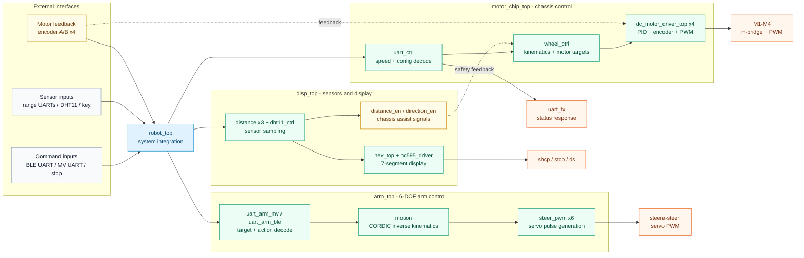

<div align="center">

# 🤖 RoboMotion-FPGA

**FPGA-Based Omnidirectional Mobile Manipulator Control System**

    [](verilog/) [](constrain/)

[中文文档](README_CN.md) &nbsp;·&nbsp; [Architecture](#-architecture) &nbsp;·&nbsp; [Modules](#-modules) &nbsp;·&nbsp; [UART Protocol](#-uart-protocol) &nbsp;·&nbsp; [Quick Start](#-quick-start)

</div>

---

## 📖 Overview

> **RoboMotion-FPGA** is a complete Verilog HDL control system for a mobile manipulation robot targeting Xilinx FPGA platforms. It integrates an omnidirectional four-wheel chassis, a 6-DOF robotic arm, sensor and display peripherals, and multiple UART command interfaces into a single, unified top-level hardware design — purpose-built for autonomous mobile grasping applications.

---

## ✨ Highlights

<table>
<tr>
<td width="33%" valign="top">

<h3 align="center">🚗<br/>Mobile<br/>Chassis</h3>
<p>4-channel DC motor drive with encoder feedback, PWM output, and dual speed/position PID closed-loop control.</p>

</td>
<td width="33%" valign="top">

<h3 align="center">🧮<br/>Kinematics<br/>Engine</h3>
<p>Three motion models: <strong>Mecanum</strong>, <strong>4-wheel omni</strong>, and <strong>3-wheel omni</strong> — selectable at runtime via UART.</p>

</td>
<td width="33%" valign="top">

<h3 align="center">🦾<br/>Robotic<br/>Arm</h3>
<p>6-channel servo PWM with <strong>CORDIC-based inverse kinematics</strong> for precise end-effector positioning.</p>

</td>
</tr>
<tr>
<td width="33%" valign="top">

<h3 align="center">📡<br/>Multi-Protocol<br/>UART</h3>
<p>Bluetooth control, machine-vision input, telemetry TX, and FSM-based command parsing — all over configurable UART channels.</p>

</td>
<td width="33%" valign="top">

<h3 align="center">🌡️<br/>Sensor<br/>Suite</h3>
<p>DHT11 temperature &amp; humidity, ultrasonic distance ranging (×3), push-button inputs, and 74HC595-driven 7-segment display.</p>

</td>
<td width="33%" valign="top">

<h3 align="center">🔧<br/>Developer<br/>Friendly</h3>
<p>Modular hierarchy and clean top-level integration — easy to understand and extend.</p>

</td>
</tr>
</table>

---

## 🏗️ Architecture



---

## 🧱 Modules

| Subsystem | Top Module | Key Files |
|:---|:---|:---|
| 🧩 System Integration | [`robot_top.v`](verilog/rtl/top/robot_top.v) | Connects chassis, arm, display, sensors, and UART channels |
| ⚙️ Chassis Control | [`motor_chip_top.v`](verilog/rtl/top/motor_chip_top.v) | [`wheel_ctrl.v`](verilog/rtl/motion/wheel_ctrl.v), [`dc_motor_driver_top.v`](verilog/rtl/top/dc_motor_driver_top.v), [`uart_ctrl.v`](verilog/rtl/comm/uart_ctrl.v) |
| 🔄 Wheel Kinematics | [`wheel_ctrl.v`](verilog/rtl/motion/wheel_ctrl.v) | [`Mcknum_wheel_calculate.v`](verilog/rtl/motion/Mcknum_wheel_calculate.v), [`all_direction_wheel_four_calculate.v`](verilog/rtl/motion/all_direction_wheel_four_calculate.v), [`all_direction_wheel_three_calculate.v`](verilog/rtl/motion/all_direction_wheel_three_calculate.v) |
| 🔌 Motor Driver | [`dc_motor_driver_top.v`](verilog/rtl/top/dc_motor_driver_top.v) | [`controller.v`](verilog/rtl/motor/controller.v), [`controller_PID.v`](verilog/rtl/motor/controller_PID.v), [`encoder.v`](verilog/rtl/motor/encoder.v), [`pwm_generate.v`](verilog/rtl/motor/pwm_generate.v) |
| 🦾 Robotic Arm | [`arm_top.v`](verilog/rtl/top/arm_top.v) | [`motion.v`](verilog/rtl/motion/motion.v), [`steer_pwm.v`](verilog/rtl/motor/steer_pwm.v), [`uart_arm_ble.v`](verilog/rtl/comm/uart_arm_ble.v), [`uart_arm_mv.v`](verilog/rtl/comm/uart_arm_mv.v) |
| 📐 CORDIC Math | [`motion.v`](verilog/rtl/motion/motion.v) | [`cordic_sincos.v`](verilog/rtl/math/cordic_sincos.v), [`cordic_arctan.v`](verilog/rtl/math/cordic_arctan.v), [`cordic_arccos.v`](verilog/rtl/math/cordic_arccos.v), [`cordic_arctanh.v`](verilog/rtl/math/cordic_arctanh.v) |
| 📟 Sensors & Display | [`disp_top.v`](verilog/rtl/top/disp_top.v) | [`dht11_ctrl.v`](verilog/rtl/peripheral/dht11_ctrl.v), [`distance.v`](verilog/rtl/peripheral/distance.v), [`hc595_driver.v`](verilog/rtl/peripheral/hc595_driver.v), [`hex_top.v`](verilog/rtl/top/hex_top.v) |

---

## 📡 UART Protocol

> 💡 **Tip:** Successful configuration commands return `Set Successful!` over UART.

| Category | Command | Description | Example / Range |
|:---|:---|:---|:---|
| 🔧 System | `b<baud>` | Set UART baud rate | `b0` – `b7` |
| 🚗 Motion | `w<num>` | Select wheel kinematics model | `w0` Mecanum, `w1` 4-wheel omni, `w2` 3-wheel omni |
| ⚙️ Config | `g<value>` | Set gear ratio | `g30` |
| ⚙️ Config | `p<value>` | Set encoder PPR | `p13` |
| ⚙️ Config | `a<mm>` | Set chassis dimension A | `a200` |
| ⚙️ Config | `l<mm>` | Set chassis dimension B | `l150` |
| 🎮 Control | `x<spd>` | X-axis velocity | Signed integer |
| 🎮 Control | `y<spd>` | Y-axis velocity | Signed integer |
| 🎮 Control | `z<spd>` | Rotation velocity | Signed integer |
| 💃 Action | Dance command | Preset motion sequence | Parsed by [`dance_cmd.v`](verilog/rtl/motion/dance_cmd.v) |
| 🦾 Arm | BLE / MV cmd | Grab, move, and place actions | Parsed by arm UART modules |

---

## 📁 Repository Layout

```text
RoboMotion-FPGA/
├── verilog/                          📦 56 Hardware Source Files
│   ├── rtl/                          🔧 RTL Design Sources
│   │   ├── top/                      🧩 System Tops (robot_top, arm_top, motor_chip_top, ...)
│   │   ├── comm/                     📨 UART Communication (uart_*, fsm_baud)
│   │   ├── motion/                   🔄 Kinematics & Motion Control
│   │   ├── motor/                    🔌 Motor Driver, PID, Encoder, PWM
│   │   ├── math/                     📐 CORDIC, Multiplier, Divider
│   │   ├── peripheral/               🌡️ Sensor, Display, Timer, Key Filter
│   │   └── protocol/                 📋 FSM Protocol Parsers (fsm_gr, fsm_ppr, ...)
│   ├── filelists/                    📋 Filelists (filelist.f, fpgafiles.vf)
│   ├── tb/                           🧪 Testbenches
│   └── sim/                          📊 Simulation
├── constrain/                        📏 Pin Constraints
│   ├── robot_top_constrain.xdc
│   └── disp_top_constrain.xdc
└── README.md / README_CN.md          📖 Documentation
```

<details>
<summary><b>🔍 Expand Full Hardware Topology</b></summary>

```text
robot_top
├── disp_top
│   ├── hex_top / hc595_driver
│   ├── dht11_ctrl
│   ├── distance ×3
│   ├── uart_ble
│   └── switch_key_filter
├── motor_chip_top
│   ├── wheel_ctrl
│   │   ├── Mcknum_wheel_calculate
│   │   ├── all_direction_wheel_four_calculate
│   │   ├── all_direction_wheel_three_calculate
│   │   └── dc_motor_driver_top ×4
│   │       ├── encoder / encoder_AB_detect
│   │       ├── controller / controller_PID / controller_Speed_loop
│   │       ├── pwm_generate
│   │       └── dc_motor_driver
│   └── uart_ctrl
│       ├── fsm_gr / fsm_ppr / fsm_wheel / fsm_a_len / fsm_b_len / fsm_baud
│       ├── uart_cmd / dance_cmd
│       ├── multiplier / divider
│       └── uart_data_tx
└── arm_top
    ├── motion
    │   ├── cordic_sincos
    │   ├── cordic_arctan
    │   └── cordic_arccos
    ├── steer_pwm ×6
    ├── uart_arm_mv
    └── uart_arm_ble
```

</details>

---

## 🛠️ Development Environment

| Tool | Purpose |
|:---|:---|
|  | Synthesis, implementation, timing analysis, and bitstream generation |
|  | Target hardware; see `.xdc` files for package pin assignments |

---

## 🚀 Quick Start

| Step | Action |
|:---:|:---|
| **1** | Create a new project in **Xilinx Vivado** |
| **2** | Add all Verilog sources from [`verilog/rtl/`](verilog/rtl/) |
| **3** | Add XDC constraints from [`constrain/`](constrain/) |
| **4** | Set [`robot_top.v`](verilog/rtl/top/robot_top.v) as the **system top module** |
| **5** | Run **Synthesis → Implementation → Generate Bitstream** |
| **6** | Download the bitstream to your FPGA board and power on |

---

## 📊 Project Stats

| Metric | Count |
|:---|:---:|
| Verilog Modules | **56** |
| XDC Constraints | **2** |
| CORDIC Operators | **4** |
| Kinematic Models | **3** |
| UART Interfaces | **4+** |
| Motor Channels | **4** |
| Servo Channels | **6** |

---

## 📜 License

This project is intended for **educational and research use**.

---

<div align="center">

[⬆ Back to top](#-robomotion-fpga)

</div>
