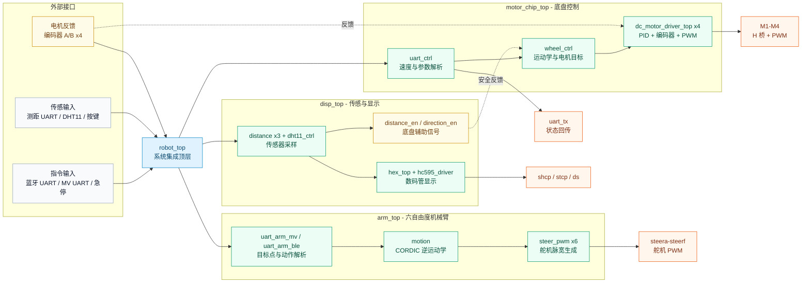

<div align="center">

# 🤖 RoboMotion-FPGA

**基于 FPGA 的全向移动机械臂控制系统**

    [](verilog/) [](constrain/)

[English](README.md) &nbsp;·&nbsp; [系统架构](#-系统架构) &nbsp;·&nbsp; [核心模块](#-核心模块) &nbsp;·&nbsp; [UART 协议](#-uart-协议) &nbsp;·&nbsp; [快速开始](#-快速开始)

</div>

---

## 📖 项目概述

> **RoboMotion-FPGA** 是一个面向 Xilinx FPGA 平台的完整 Verilog HDL 机器人控制系统。工程将全向四轮移动底盘、六自由度机械臂、传感器与显示外设、以及多路 UART 指令接口集成到统一的顶层硬件设计中——专为自主移动抓取应用而构建。

---

## ✨ 项目亮点

<table>
<tr>
<td width="33%" valign="top">

<h3 align="center">🚗<br/>移动<br/>底盘</h3>
<p>4 路直流电机驱动，集成编码器反馈、PWM 输出，支持速度/位置双 PID 闭环控制。</p>

</td>
<td width="33%" valign="top">

<h3 align="center">🧮<br/>运动学<br/>引擎</h3>
<p>支持 <strong>麦克纳姆轮</strong>、<strong>全向四轮</strong>、<strong>全向三轮</strong> 三种运动模型，可通过 UART 实时切换。</p>

</td>
<td width="33%" valign="top">

<h3 align="center">🦾<br/>机械臂<br/>控制</h3>
<p>6 路舵机 PWM 输出，基于 <strong>CORDIC 算法的逆运动学解算</strong>，实现精准末端定位。</p>

</td>
</tr>
<tr>
<td width="33%" valign="top">

<h3 align="center">📡<br/>多协议<br/>UART</h3>
<p>蓝牙控制、机器视觉输入、状态数据回传、FSM 指令解析——全部通过可配置的 UART 通道实现。</p>

</td>
<td width="33%" valign="top">

<h3 align="center">🌡️<br/>传感器<br/>套件</h3>
<p>DHT11 温湿度采集、超声波测距（×3）、按键输入、74HC595 数码管显示——环境感知与信息输出一体化。</p>

</td>
<td width="33%" valign="top">

<h3 align="center">🔧<br/>开发者<br/>友好</h3>
<p>模块化层级结构清晰，顶层集成简洁明了——易于理解、便于扩展。</p>

</td>
</tr>
</table>

---

## 🏗️ 系统架构



---

## 🧱 核心模块

| 子系统 | 顶层模块 | 关键文件 |
|:---|:---|:---|
| 🧩 系统集成 | [`robot_top.v`](verilog/rtl/top/robot_top.v) | 连接底盘、机械臂、显示、传感器与 UART 通道 |
| ⚙️ 底盘控制 | [`motor_chip_top.v`](verilog/rtl/top/motor_chip_top.v) | [`wheel_ctrl.v`](verilog/rtl/motion/wheel_ctrl.v)、[`dc_motor_driver_top.v`](verilog/rtl/top/dc_motor_driver_top.v)、[`uart_ctrl.v`](verilog/rtl/comm/uart_ctrl.v) |
| 🔄 轮系运动学 | [`wheel_ctrl.v`](verilog/rtl/motion/wheel_ctrl.v) | [`Mcknum_wheel_calculate.v`](verilog/rtl/motion/Mcknum_wheel_calculate.v)、[`all_direction_wheel_four_calculate.v`](verilog/rtl/motion/all_direction_wheel_four_calculate.v)、[`all_direction_wheel_three_calculate.v`](verilog/rtl/motion/all_direction_wheel_three_calculate.v) |
| 🔌 电机闭环驱动 | [`dc_motor_driver_top.v`](verilog/rtl/top/dc_motor_driver_top.v) | [`controller.v`](verilog/rtl/motor/controller.v)、[`controller_PID.v`](verilog/rtl/motor/controller_PID.v)、[`encoder.v`](verilog/rtl/motor/encoder.v)、[`pwm_generate.v`](verilog/rtl/motor/pwm_generate.v) |
| 🦾 机械臂控制 | [`arm_top.v`](verilog/rtl/top/arm_top.v) | [`motion.v`](verilog/rtl/motion/motion.v)、[`steer_pwm.v`](verilog/rtl/motor/steer_pwm.v)、[`uart_arm_ble.v`](verilog/rtl/comm/uart_arm_ble.v)、[`uart_arm_mv.v`](verilog/rtl/comm/uart_arm_mv.v) |
| 📐 CORDIC 运算 | [`motion.v`](verilog/rtl/motion/motion.v) | [`cordic_sincos.v`](verilog/rtl/math/cordic_sincos.v)、[`cordic_arctan.v`](verilog/rtl/math/cordic_arctan.v)、[`cordic_arccos.v`](verilog/rtl/math/cordic_arccos.v)、[`cordic_arctanh.v`](verilog/rtl/math/cordic_arctanh.v) |
| 📟 传感与显示 | [`disp_top.v`](verilog/rtl/top/disp_top.v) | [`dht11_ctrl.v`](verilog/rtl/peripheral/dht11_ctrl.v)、[`distance.v`](verilog/rtl/peripheral/distance.v)、[`hc595_driver.v`](verilog/rtl/peripheral/hc595_driver.v)、[`hex_top.v`](verilog/rtl/top/hex_top.v) |

---

## 📡 UART 协议

> 💡 **提示：** 配置指令成功后，UART 将返回 `Set Successful!`。

| 类别 | 指令 | 功能 | 示例 / 范围 |
|:---|:---|:---|:---|
| 🔧 系统 | `b<baud>` | 设置 UART 波特率 | `b0` – `b7` |
| 🚗 运动 | `w<num>` | 选择轮系运动模型 | `w0` 麦克纳姆，`w1` 全向四轮，`w2` 全向三轮 |
| ⚙️ 参数 | `g<value>` | 设置减速比 | `g30` |
| ⚙️ 参数 | `p<value>` | 设置编码器 PPR | `p13` |
| ⚙️ 参数 | `a<mm>` | 设置底盘尺寸 A | `a200` |
| ⚙️ 参数 | `l<mm>` | 设置底盘尺寸 B | `l150` |
| 🎮 控制 | `x<spd>` | X 轴速度 | 有符号整数 |
| 🎮 控制 | `y<spd>` | Y 轴速度 | 有符号整数 |
| 🎮 控制 | `z<spd>` | 旋转速度 | 有符号整数 |
| 💃 动作 | 舞蹈指令 | 预设运动序列 | 由 [`dance_cmd.v`](verilog/rtl/motion/dance_cmd.v) 解析 |
| 🦾 机械臂 | 蓝牙 / MV 指令 | 抓取、移动、放置 | 由机械臂 UART 模块解析 |

---

## 📁 工程结构

```text
RoboMotion-FPGA/
├── verilog/                          📦 56 个硬件源文件
│   ├── rtl/                          🔧 RTL 设计源码
│   │   ├── top/                      🧩 系统顶层（robot_top、arm_top、motor_chip_top ……）
│   │   ├── comm/                     📨 UART 通信（uart_*、fsm_baud）
│   │   ├── motion/                   🔄 运动学与运动控制
│   │   ├── motor/                    🔌 电机驱动、PID、编码器、PWM
│   │   ├── math/                     📐 CORDIC、乘法器、除法器
│   │   ├── peripheral/               🌡️ 传感器、显示、定时器、按键滤波
│   │   └── protocol/                 📋 FSM 协议解析（fsm_gr、fsm_ppr ……）
│   ├── filelists/                    📋 文件列表（filelist.f、fpgafiles.vf）
│   ├── tb/                           🧪 测试平台
│   └── sim/                          📊 仿真
├── constrain/                        📏 管脚约束
│   ├── robot_top_constrain.xdc
│   └── disp_top_constrain.xdc
└── README.md / README_CN.md          📖 说明文档
```

<details>
<summary><b>🔍 展开完整硬件拓扑</b></summary>

```text
robot_top
├── disp_top
│   ├── hex_top / hc595_driver
│   ├── dht11_ctrl
│   ├── distance ×3
│   ├── uart_ble
│   └── switch_key_filter
├── motor_chip_top
│   ├── wheel_ctrl
│   │   ├── Mcknum_wheel_calculate
│   │   ├── all_direction_wheel_four_calculate
│   │   ├── all_direction_wheel_three_calculate
│   │   └── dc_motor_driver_top ×4
│   │       ├── encoder / encoder_AB_detect
│   │       ├── controller / controller_PID / controller_Speed_loop
│   │       ├── pwm_generate
│   │       └── dc_motor_driver
│   └── uart_ctrl
│       ├── fsm_gr / fsm_ppr / fsm_wheel / fsm_a_len / fsm_b_len / fsm_baud
│       ├── uart_cmd / dance_cmd
│       ├── multiplier / divider
│       └── uart_data_tx
└── arm_top
    ├── motion
    │   ├── cordic_sincos
    │   ├── cordic_arctan
    │   └── cordic_arccos
    ├── steer_pwm ×6
    ├── uart_arm_mv
    └── uart_arm_ble
```

</details>

---

## 🛠️ 开发环境

| 工具 | 用途 |
|:---|:---|
|  | 综合、实现、时序分析与比特流生成 |
|  | 目标硬件平台，具体管脚分配见 `.xdc` 约束文件 |

---

## 🚀 快速开始

| 步骤 | 操作 |
|:---:|:---|
| **1** | 在 **Xilinx Vivado** 中创建新工程 |
| **2** | 添加 [`verilog/rtl/`](verilog/rtl/) 目录下的全部 Verilog 源文件 |
| **3** | 添加 [`constrain/`](constrain/) 目录下的 XDC 约束文件 |
| **4** | 将 [`robot_top.v`](verilog/rtl/top/robot_top.v) 设置为 **系统顶层模块** |
| **5** | 依次运行 **综合 → 实现 → 生成 Bitstream** |
| **6** | 将 bitstream 下载到 FPGA 开发板并上电运行 |

---

## 📊 项目统计

| 指标 | 数量 |
|:---|:---:|
| Verilog 模块 | **56** |
| XDC 约束文件 | **2** |
| CORDIC 运算器 | **4** |
| 运动学模型 | **3** |
| UART 接口 | **4+** |
| 电机通道 | **4** |
| 舵机通道 | **6** |

---

## 📜 许可

本项目仅供 **教育与研究** 使用。

---

<div align="center">

[⬆ 回到顶部](#-robomotion-fpga)

</div>
